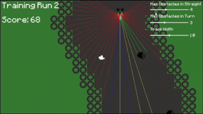

# Reinforcement Learning Autonomous Racecar

An autonomous racing agent trained using reinforcement learning to navigate procedurally generated racetracks with obstacles.

<p align="center">
  
</p>

## Overview

This project implements an autonomous racing agent using Unity's ML-Agents toolkit and Proximal Policy Optimization (PPO). The agent learns to navigate procedurally generated tracks filled with obstacles including tires, oil slicks, barriers, and ramps through trial and error reinforcement learning.

<p align="center">
  
</p>

### Features

- **Procedurally Generated Tracks**: Variety of track configurations with dynamic difficulty
- **PPO-Based Training**: Stable and efficient policy learning with curiosity-driven exploration
- **Curriculum Learning**: Progressive difficulty stages from basic navigation to complex obstacle courses
- **Discrete Action Space**: Three actions (left, straight, right) for realistic decision-making
- **Multiple Obstacle Types**: Tires (collision), oil slicks (temporary control loss), barriers, and ramps
- **Ray-Cast Perception**: 41-ray sensor system for environmental awareness (240° field of view)

### Training Progression

The agent was trained through 5 curriculum stages over 15 million steps:

1. **Stage 1 - Basic Navigation**: Track following with basic barriers only
2. **Stage 2 - Obstacle Introduction**: Adding tire obstacles
3. **Stage 3 - High Density**: Increased tire obstacle density for adaptation
4. **Stage 4 - Dynamic Hazards**: Oil slicks causing temporary control loss
5. **Stage 5 - Full Complexity**: All obstacles combined with ramps

<p align="center">
  
</p>

### Performance Metrics

- **Final Cumulative Reward**: 20-80 (stable performance)
- **Episode Length**: 6,000-8,000 steps
- **Training Duration**: 15 million steps (~72 hours on Apple M1 Pro)
- **Policy Entropy**: Converged to 0.899 (confident, deterministic policy)

## Technical Architecture

### Reinforcement Learning Setup

**Algorithm**: Proximal Policy Optimization (PPO)

- Important [Hyperparameters](Assets/config/config_single.yaml)
  - **Batch Size**: 256
  - **Learning Rate**: 1e-4
  - **Hidden Layers**: 2 layers × 128 units
  - **Time Horizon**: 750 steps
  - **Gamma (Discount Factor)**: 0.99

**Observation Space** (287 observations total):

- Position (x, y) and velocity (vx, vy): 4 values
- Smoothed movement input: 1 value
- 41 raycasts × 6 values each (distance + 5 object type flags): 246 values
  - Detects: walls, obstacles (tires), oil slicks, ramps, barriers
  - 240° field of view for comprehensive spatial awareness

**Action Space** (Discrete):

- 0: Continue straight
- 1: Turn left
- 2: Turn right

**Reward Structure**:

- `+0.001` per step alive (survival incentive)
- `+1.0` every 5 units of successful forward progress
- `+10.0` for using ramps strategically
- `-50.0` for hitting walls or tires (episode termination)
- `-25.0` for hitting oil slicks
- `-0.005 × |steering|` penalty to reduce jerky movements

### Procedural Content Generation (PCG)

The track generation system creates variety through:

- **Dynamic Segment Generation**: 10-tile vertical segments with procedural turns
- **Rule-Based Obstacle Placement**: Spawning with spatial constraints
  - Minimum 3 units from walls
  - Vertical spacing of 3 units between obstacles
  - Path-blocking prevention algorithm within barriers
- **Barrier System**: Random barrier placement with guaranteed safe passage
  - Opening width: 3-4 tiles
  - Safe zones enforced (8 units before, 5 units after barriers)
- **Weighted Obstacle Spawning**: Configurable spawn probabilities per obstacle type
- **Bounds Management**: Track stays within camera view with turn constraints

## Technologies Used

- **Unity** - Game engine and simulation environment
- **ML-Agents Toolkit** - Reinforcement learning framework
- **TensorBoard** - Training visualisation and metrics

## Installation

### Prerequisites

- Unity 2022.3 LTS or later
- Python 3.9+
- pip and pipenv

### Setup

1. **Clone the repository**

```bash
git clone https://github.com/mattpri22/RL-Racing-Game.git
cd RL-Racing-Game
```

2. **Install ML-Agents Python Package**

```bash
cd Assets/config
pipenv shell
pip install protobuf==3.20
pip install mlagents==3.0.0
```

3. **Open in Unity**

   - Open Unity Hub
   - Select the cloned folder
   - Unity will import packages (may take several minutes)

4. **Open Scenes**
   - **Player Mode**: `Assets/Scenes/Player` (manual control for testing)
   - **RL Agent Mode**: `Assets/Scenes/RL Agent` (trained agent demonstration)
   - **Main Menu**: `Assets/Scenes/MainMenu` (navigation between modes)

## Usage

### Playing Manually (Player Mode)

1. Open `MainMenu` scene and click "Player Mode"
2. Use **Arrow Keys** to control the car:
   - `Left Arrow`: Turn left
   - `Right Arrow`: Turn right
3. Avoid obstacles and barriers
4. You have 3 attempts per session before game ends

### Watching Trained Agent (Agent Mode)

1. Open `MainMenu` scene and click "RL Agent Mode"
2. The trained agent will autonomously navigate the track
3. Adjust difficulty sliders in real-time:
   - Max obstacles in straight sections
   - Max obstacles in turns
   - Track width

## Project Structure

```
RL-Racing-Game/
├── Assets/
│   ├── Scenes/
│   │   ├── MainMenu.unity                        # Navigation menu
│   │   ├── Player.unity                          # Manual control mode
│   │   └── RL Agent.unity                        # Trained agent demonstration
│   ├── Scripts/
│   │   ├── Player/
│   │   │   ├── CarController.cs                  # Manual control logic
│   │   │   ├── CameraFollow.cs                   # Y-axis camera tracking
│   │   │   ├── ProceduralTrackGeneration.cs      # PCG system
│   │   │   └── ScoreScript.cs                    # Player scoring (3 runs)
│   │   ├── Reinforcement Learning/
│   │   │   ├── CarAgent.cs                       # RL agent (observations, actions, rewards)
│   │   │   ├── CarControllerAgent.cs             # Agent movement controller
│   │   │   └── ScoreAgent.cs                     # Agent scoring (infinite runs)
│   │   └── UI/
│   │       ├── ButtonBehaviour.cs                # Scene transitions
│   │       └── GameSettingUI.cs                  # Dynamic difficulty sliders
│   ├── config/
│   │   └── config_single.yaml                    # PPO hyperparameters
│   ├── Prefabs/                                  # Car, obstacles, track tiles
│   ├── Materials/                                # Sprites and visual assets
│   └── ML-Agents/                                # ML-Agents package
├── Packages/
├── ProjectSettings/
└── README.md
```

## Future Improvements

- Adaptive curriculum based on real-time performance metrics
- Visual observation mode (camera input instead of ray-casts)
- Continuous action space for smoother steering
- Hybrid approach with pathfinding algorithms (for example A\*)

## License

This project is distributed under the [MIT License](LICENSE).
